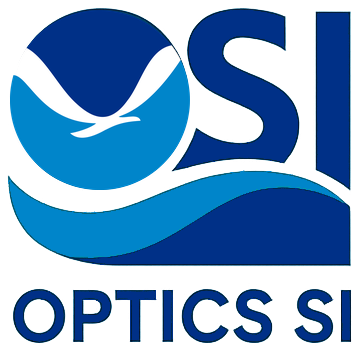

# Optics SI Docs

Operational documentation and implementation guidance for the Optics Strategic Initiative (OSI) Cloud.

## What this covers
- Program overview and operating model
- End-to-end data and annotation pipelines
- Hardware and camera information
- Software and toolchain guidance
- Cloud storage conventions
- Cloud processing workflows (including VIAME Web App and Girder)
- Model lifecycle guidance (VIAME, Ultralytics, and bring-your-own-model)
- Shared resources and FAQ

## Site structure
- Overview
- Pipelines
- Hardware
- Software and Tools
- Cloud Storage
- Cloud Processing
- Models and Integration
- Hands-On Notebooks
- Resources

## Status
This repository is being actively modernized from an earlier template into an OSI-first documentation hub. Some pages are structured placeholders and will be expanded iteratively.

----------
#### Disclaimer
This repository is a scientific product and is not official communication of the National Oceanic and Atmospheric Administration, or the United States Department of Commerce. All NOAA GitHub project content is provided on an ‘as is’ basis and the user assumes responsibility for its use. Any claims against the Department of Commerce or Department of Commerce bureaus stemming from the use of this GitHub project will be governed by all applicable Federal law. Any reference to specific commercial products, processes, or services by service mark, trademark, manufacturer, or otherwise, does not constitute or imply their endorsement, recommendation or favoring by the Department of Commerce. The Department of Commerce seal and logo, or the seal and logo of a DOC bureau, shall not be used in any manner to imply endorsement of any commercial product or activity by DOC or the United States Government.

#### License
- Details in the [LICENSE.md](./LICENSE.md) file.